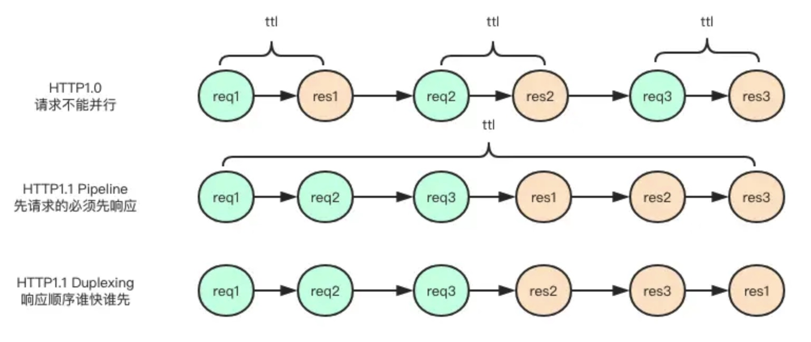
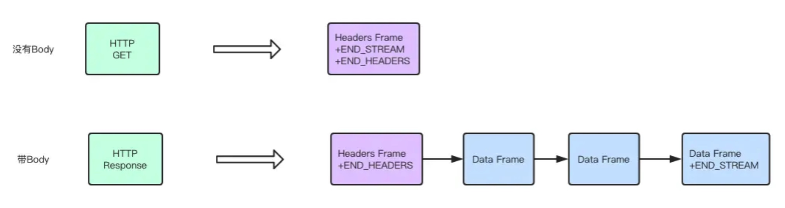
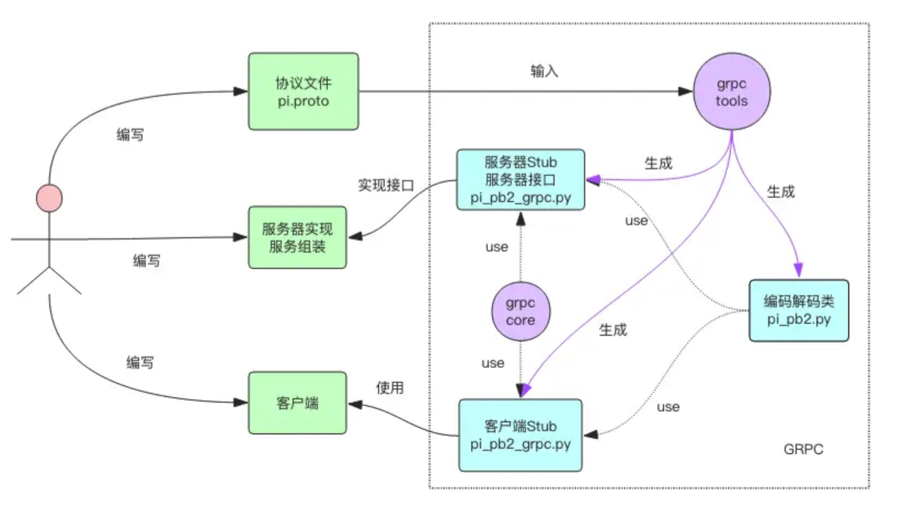
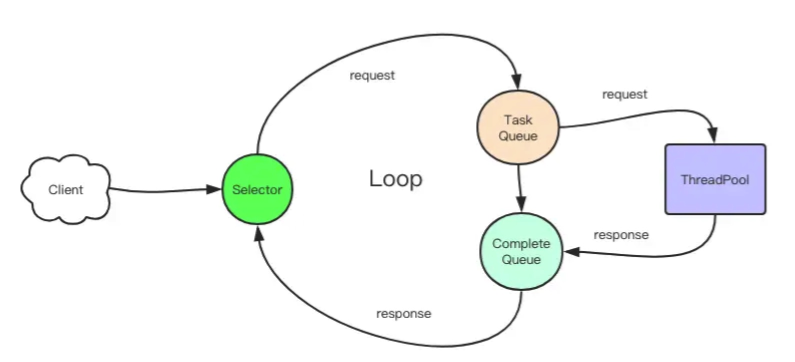

# Chapter 18 Notes

TCP -> HTTP2.0 -> gRPC
- Streaming 串流
- Duplexing 双通，同一时间可以双向通信

## HTTP 2.0
### duplexing
- HTTP1.1 还是基于文本协议的问答有序模式
- HTTP2.0 是基于二进制协议的乱序模式 (Duplexing)

HTTP evolution


### header 优化
- HTTP 协议的请求头有大量的 key/value 文本组成，多个请求直接 key/value 重复程度很高。
- HTTP2.0 对请求头的 key/value 做了字典处理，对于常用的 key/value 文本无需重复传送，
而是通过引用内部字典的整数索引来达到显著节省请求头传输流量的目的。

### framing & streaming
- 在 HTTP1.1 里面如果一个响应的内容太大，一般使用 chunk 模式进行分块传输。
- 在 HTTP2.0 里面它也有分块传送，但是概念上叫着Framing——分帧传送。
  - 同一个响应会有同一个流 IDstream_id，消息接收端会将具有相同stream_id的消息帧串起来作为一个整体来处理，
  - 位于流的最后一个消息帧会有一个流结束标志位(EOS——End of Stream)。
  - 注意 EOS 并不意味着连接的中止，同一个连接上会有多个流穿插传输，结束了单个流还会有很多其它的流在继续传送。

#### frame format
- length: 3 bytes
- type: 1 byte 可以存储 2^8-1=255 种类型
  - HEADERS 帧 头信息，对应于HTTP HEADER
  - DATA 帧 对应于HTTP Response Body
  - PRIORITY 帧 用于调整流的优先级
  - RST_STREAM 帧 流终止帧，用于中断资源的传输
  - SETTINGS 帧 用户客户服务器交流连接配置信息
  - PUSH_PROMISE 帧 服务器向客户端主动推送资源
  - GOAWAY 帧 礼貌地通知对方断开连接
  - PING 帧 心跳帧，检测往返时间和连接可用性
  - WINDOW_UPDATE 帧 调整帧窗口大小
  - CONTINUATION 帧 HEADERS 帧太大时分块的续帧
- flags: 1 byte 标志位 - 帧的属性
  - END_STREAM 流结束标志，表示当前帧是流的最后一个帧
  - END_HEADERS 头结束表示，表示当前帧是头信息的最后一个帧
  - PADDED 填充标志，在数据 Payload 里填充无用信息，用于干扰信道监听
- stream id: 4 bytes
- payload: length

最常用的 HTTP 请求 / 响应的帧形式如下，带类型和标志位


从上图可以看出，标志位可以放在 HEADERS 类型的帧里面，也可以放在 DATA 类型的帧里面

### Protobuf
- Protobuf 协议仅仅定义了单个消息的序列化格式
- Protobuf 将消息序列化后，内容放在 HTTP2.0 的 Data 帧的 Payload 字段里，
- 消息的长度在 Data 帧的 Length 字段里，
- 消息的类名称放在 Headers 帧的 Path 头信息中。
- 需要通过头部字段的 Path 来确定具体消息的解码器来反序列化 Data 帧的 Payload 内容

## gRPC
gRPC 的数据流示意图


### 步骤
- 编写协议文件 pi.proto
- 使用grpc_tools工具将 pi.proto编译成pi_pb2.py和pi_pb2_grpc.py两个文件
- 使用pi_pb2_grpc.py文件中的服务器接口类，编写服务器具体逻辑实现
- 使用pi_pb2_grpc.py文件中的客户端 Stub，编写客户端交互代码
- 分别运行服务器和客户端，观察输出结果

### 安装依赖
`pip install grpcio_tools  # tools 包含代码生成工具，会自动安装依赖的 grpcio 包`

### 编写协议文件 pi.proto
协议文件包含：
- 输入消息PiRequest、
- 输出消息PiResponse
- 和 rpc 服务调用的定义PiCalculator

### 使用grpc_tools工具将 pi.proto编译成pi_pb2.py和pi_pb2_grpc.py两个文件
仿照 pi.proto 写 ping.proto 文件
```
python -m grpc_tools.protoc -I. --python_out=. --grpc_python_out=. ping.proto
```
- python_out目录指定pi_pb2.py文件的输出路径，
- grpc_python_out指定pi_pb2_grpc.py文件的输出路径。
- -I参数指定协议文件的查找目录，
- '.' 代表当前目录
- pi_pb2.py 是消息序列化类，
- pi_pb2_grpc.py 包含了服务器 Stub 类和客户端 Stub 类，以及待实现的服务 RPC 接口

### 线程模型
gRPC 默认使用的是异步 IO 模型，底层有一个独立的事件循环。
它的异步不是使用 Python 内置的 asyncio 来完成的，它使用的是开源异步事件框架 gevent。
gevent 的优势在于可以让用户使用同步的代码编写异步的逻辑，而完全不知内部正在进行复杂的协程调度，这样可以明显降低框架代码的实现复杂度。
grpc 服务器端接收到一个完整的消息包后就会传递到线程池去进行业务逻辑处理，线程池是由用户层代码来指定的，
待线程池将任务执行完成后会将结果扔到 IO 模型的完成队列中进行后续的响应处理。

对于以上描述我存疑，阅读源码没有看到 gevent 相关的导入，反而看到很多的 thread 多线程代码。



通过查阅代码并对比上图，找到了 complete queue，但是没有看到 task queue

### benchmark
把 client.py 中打印去掉，循环从10增加到1000
把 multithread.py 中打印去掉，使用 time 对比二者的执行时间效率
```
(.venv) Franks-Mac:chapter18 frank$ time python client.py 
StatusCode.INVALID_ARGUMENT request number should be positive

real    0m0.627s
user    0m0.202s
sys     0m0.106s
(.venv) Franks-Mac:chapter18 frank$ time python multithread_client.py 

real    0m0.824s
user    0m0.278s
sys     0m0.181s
```
反而多线程的更加慢，原因在于 Python 服务器的 GIL 限制了程序最多只能使用单个 CPU 核心，多线程来回切换资源分配和上下文恢复耗费事件。
差别不是太大，虽然是多线程服务器，但是实际上对于纯计算性操作来说，多线程的执行效率跟单线程没有区别。

增加 time.sleep(0.01)
```
(.venv) Franks-Mac:chapter18 frank$ time python client.py 
StatusCode.INVALID_ARGUMENT request number should be positive

real    0m13.624s
user    0m0.582s
sys     0m0.251s
(.venv) Franks-Mac:chapter18 frank$ time python multithread_client.py 

real    0m2.083s
user    0m0.609s
sys     0m0.463s
```
这就要快了不少。

### PreForking 模型

注意 gRPC 暂时不支持多进程模式，如果要支持多进程模型，gRPC 官方表示还需要做大量的改造，目前 gRPC 还不支持 fork，

### streaming
gRPC 的一个特色之处在于提供了 Streaming 模式，有了 Streaming 模式，客户端可以将一连串的请求连续发送到服务器，
服务器也可以将一连串连续的响应回复给客户端

对比前面的同步调用，Streaming 可以理解为 gRPC 的异步调用。

Streaming 它允许一个人同时说又同时听，双工对话，人类在这方面的能力那是很欠缺的。

这个协议差别很小，就是在输入输出类型上增加了 stream 关键字就可以将输入输出同时变成流式了。
不过还得注意到输出消息增加了一个参数，这个参数 n 就是输入的参数 n。
当协议变成流式之后，输入和输出的对应关系需要在协议层面进行维护。
因为不是所有的请求都会有响应，服务器可以忽略掉某些请求不进行处理，也就是输入和输出不再是一对一的关系。

streaming 下面的 pi.proto 定义比 chapter18 下面 多个 stream 在 PiResponse 和 PiRequest 前面

```
// pi service
service PiCalculator {
	// pi method
	rpc Calc(stream PiRequest) returns (stream PiResponse) {}
}

// pi output
message PiResponse {
	int32  n = 1;
	double value = 2;
}
```

server.py 里面 Calc 方法的返回从 return 变成 yield

- 服务器差别也很小，只是在 RPC 方法的输入和输出分别变成了迭代器和生成器
- 客户端的差别在于 RPC 的输入参数是一个生成器，输出是一个迭代器，这个跟服务器正好对应起来。

### 异常错误码
```
class StatusCode(enum.Enum):
    # 默认正常
    OK = (_cygrpc.StatusCode.ok, 'ok')
    # RPC 调用取消
    CANCELLED = (_cygrpc.StatusCode.cancelled, 'cancelled')
    # 未知错误，一般是服务器业务逻辑抛出了一个异常
    UNKNOWN = (_cygrpc.StatusCode.unknown, 'unknown')
    # 参数错误
    INVALID_ARGUMENT = (_cygrpc.StatusCode.invalid_argument, 'invalid argument')
    # 调用超时
    DEADLINE_EXCEEDED = (_cygrpc.StatusCode.deadline_exceeded, 'deadline exceeded')
    # 资源没找到
    NOT_FOUND = (_cygrpc.StatusCode.not_found, 'not found')
    # 资源重复创建
    ALREADY_EXISTS = (_cygrpc.StatusCode.already_exists, 'already exists')
    # 权限不足
    PERMISSION_DENIED = (_cygrpc.StatusCode.permission_denied, 'permission denied')
    # 资源不够
    RESOURCE_EXHAUSTED = (_cygrpc.StatusCode.resource_exhausted, 'resource exhausted')
    # 预检失败
    FAILED_PRECONDITION = (_cygrpc.StatusCode.failed_precondition, 'failed precondition')
    # 调用中止
    ABORTED = (_cygrpc.StatusCode.aborted, 'aborted')
    # 超出资源既有范围，比如断点续传的 offset 值超出文件长度
    OUT_OF_RANGE = (_cygrpc.StatusCode.out_of_range, 'out of range')
    # 服务器未实现协议中定义的 Service 接口
    UNIMPLEMENTED = (_cygrpc.StatusCode.unimplemented, 'unimplemented')
    # 服务器内部错误
    INTERNAL = (_cygrpc.StatusCode.internal, 'internal')
    # 服务挂了
    UNAVAILABLE = (_cygrpc.StatusCode.unavailable, 'unavailable')
    # 数据丢失
    DATA_LOSS = (_cygrpc.StatusCode.data_loss, 'data loss')
    # 鉴权错误
    UNAUTHENTICATED = (_cygrpc.StatusCode.unauthenticated, 'unauthenticated')
```

### 单向消息
还有一种重要的消息类型叫单向 oneway 消息，这类消息适合不重要的日志型数据，发向了服务器不要求有响应，即使消息丢失了也无所谓。

- gRPC 不支持这类消息，gRPC 强制要求输入和输出都必须有类型，如果不需要返回结果，也必须使用内置的 Empty 的消息类型作为返回。
- 相比而言，Thrift 是支持 oneway 消息的，
- 阿里的 SOFA RPC 也支持 oneway 消息。

### 重试
gRPC 默认不支持重试，如果 RPC 调用遇到错误，会立即向上层抛出错误。
重试与否只能由用户自己的业务代码来进行控制或者由拦截器来统一控制。

### 超时
gRPC 默认支持超时选项，当客户端发起请求时，可以携带参数 timeout 指定最长响应时间，
如果 timeout 时间内，服务器还没有返回结果，客户端就会抛出超时异常。
````
client.Calc(pi_pb2.PiRequest(n=i), timeout=5)  # 5s 超时
````

### 拦截器 interceptors
gRPC 在客户端和服务器都提供了拦截器选项，用户可以通过拦截器拦截请求和响应。
比如客户端可以通过拦截器统一在请求头里面增加 metadata，服务器可以通过拦截器来跟踪 RPC 调用性能等。

      interceptors: An optional list of ServerInterceptor objects that observe
        and optionally manipulate the incoming RPCs before handing them over to
        handlers. The interceptors are given control in the order they are
        specified. This is an EXPERIMENTAL API.

### 分布式 gRPC 服务
gRPC 服务器虽然性能好，但是压力大了，单个进程单个机器还是不够，最终是必须要上分布式的。
分布式解决方案和普通的 RPC 大同小异，也是需要一个配置数据库来存储服务列表信息，常用的这类数据库由 zk、etcd 和 consul 等。
读者可以使用实战小节的分布式方法包装一下 gRPC 的代码，就可以打造出分布式 gRPC 服务了。

## understanding of source code
### grpc.server
```python
def server(thread_pool,
           handlers=None,
           interceptors=None,
           options=None,
           maximum_concurrent_rpcs=None,
           compression=None,
           xds=False):
    """Creates a Server with which RPCs can be serviced.

    Args:
      thread_pool: A futures.ThreadPoolExecutor to be used by the Server
        to execute RPC handlers.
      handlers: An optional list of GenericRpcHandlers used for executing RPCs.
        More handlers may be added by calling add_generic_rpc_handlers any time
        before the server is started.
      interceptors: An optional list of ServerInterceptor objects that observe
        and optionally manipulate the incoming RPCs before handing them over to
        handlers. The interceptors are given control in the order they are
        specified. This is an EXPERIMENTAL API.
      options: An optional list of key-value pairs (:term:`channel_arguments` in gRPC runtime)
        to configure the channel.
      maximum_concurrent_rpcs: The maximum number of concurrent RPCs this server
        will service before returning RESOURCE_EXHAUSTED status, or None to
        indicate no limit.
      compression: An element of grpc.compression, e.g.
        grpc.compression.Gzip. This compression algorithm will be used for the
        lifetime of the server unless overridden. This is an EXPERIMENTAL option.
      xds: If set to true, retrieves server configuration via xDS. This is an
        EXPERIMENTAL option.

    Returns:
      A Server object.
    """
    from grpc import _server  # pylint: disable=cyclic-import
    return _server.create_server(thread_pool,
                                 () if handlers is None else handlers,
                                 () if interceptors is None else interceptors,
                                 () if options is None else options,
                                 maximum_concurrent_rpcs, compression, xds)

```

### futures.ThreadPoolExecutor
```python
"""Implements ProcessPoolExecutor.

The follow diagram and text describe the data-flow through the system:

|======================= In-process =====================|== Out-of-process ==|

+----------+     +----------+       +--------+     +-----------+    +---------+
|          |  => | Work Ids |    => |        |  => | Call Q    | => |         |
|          |     +----------+       |        |     +-----------+    |         |
|          |     | ...      |       |        |     | ...       |    |         |
|          |     | 6        |       |        |     | 5, call() |    |         |
|          |     | 7        |       |        |     | ...       |    |         |
| Process  |     | ...      |       | Local  |     +-----------+    | Process |
|  Pool    |     +----------+       | Worker |                      |  #1..n  |
| Executor |                        | Thread |                      |         |
|          |     +----------- +     |        |     +-----------+    |         |
|          | <=> | Work Items | <=> |        | <=  | Result Q  | <= |         |
|          |     +------------+     |        |     +-----------+    |         |
|          |     | 6: call()  |     |        |     | ...       |    |         |
|          |     |    future  |     |        |     | 4, result |    |         |
|          |     | ...        |     |        |     | 3, except |    |         |
+----------+     +------------+     +--------+     +-----------+    +---------+

Executor.submit() called:
- creates a uniquely numbered _WorkItem and adds it to the "Work Items" dict
- adds the id of the _WorkItem to the "Work Ids" queue

Local worker thread:
- reads work ids from the "Work Ids" queue and looks up the corresponding
  WorkItem from the "Work Items" dict: if the work item has been cancelled then
  it is simply removed from the dict, otherwise it is repackaged as a
  _CallItem and put in the "Call Q". New _CallItems are put in the "Call Q"
  until "Call Q" is full. NOTE: the size of the "Call Q" is kept small because
  calls placed in the "Call Q" can no longer be cancelled with Future.cancel().
- reads _ResultItems from "Result Q", updates the future stored in the
  "Work Items" dict and deletes the dict entry

Process #1..n:
- reads _CallItems from "Call Q", executes the calls, and puts the resulting
  _ResultItems in "Request Q"
"""
```

```python
class ThreadPoolExecutor(_base.Executor):

    # Used to assign unique thread names when thread_name_prefix is not supplied.
    _counter = itertools.count().next

    def __init__(self, max_workers=None, thread_name_prefix='', initializer=None, initargs=()):
        """Initializes a new ThreadPoolExecutor instance.

        Args:
            max_workers: The maximum number of threads that can be used to
                execute the given calls.
            thread_name_prefix: An optional name prefix to give our threads.
        """
        if max_workers is None:
            # Use this number because ThreadPoolExecutor is often
            # used to overlap I/O instead of CPU work.
            max_workers = (cpu_count() or 1) * 5
        if max_workers <= 0:
            raise ValueError("max_workers must be greater than 0")

        self._max_workers = max_workers
        self._initializer = initializer
        self._initargs = initargs
        self._work_queue = queue.Queue()
        self._idle_semaphore = threading.Semaphore(0)
        self._threads = set()
        self._broken = False
        self._shutdown = False
        self._shutdown_lock = threading.Lock()
        self._thread_name_prefix = (thread_name_prefix or
                                    ("ThreadPoolExecutor-%d" % self._counter()))

    def submit(self, fn, *args, **kwargs):
        with self._shutdown_lock:
            if self._broken:
                raise BrokenThreadPool(self._broken)
            if self._shutdown:
                raise RuntimeError('cannot schedule new futures after shutdown')

            f = _base.Future()
            w = _WorkItem(f, fn, args, kwargs)

            self._work_queue.put(w)
            self._adjust_thread_count()
            return f
    submit.__doc__ = _base.Executor.submit.__doc__

```

ThreadPoolExecutor 的基类 Executor（一个接口类）
```python
class Executor(object):
    """This is an abstract base class for concrete asynchronous executors."""

    def submit(self, fn, *args, **kwargs):
        """Submits a callable to be executed with the given arguments.

        Schedules the callable to be executed as fn(*args, **kwargs) and returns
        a Future instance representing the execution of the callable.

        Returns:
            A Future representing the given call.
        """
        raise NotImplementedError()

```
server.py 和 multithread_client.py 中都使用了 futures.ThreadPoolExecutor 的线程池。
```
server = grpc.server(futures.ThreadPoolExecutor(max_workers=10))
``` 
和
```
pool = futures.ThreadPoolExecutor(max_workers=10)
pool.submit(pi, client, i))
```

当 max worker 不指定时候，会默认给一个 `max_workers = (cpu_count() or 1) * 5`，本机大概是40。

获取 cpu 数目
```python
def cpu_count():
    '''
    Returns the number of CPUs in the system
    '''
    if sys.platform == 'win32':
        try:
            num = int(os.environ['NUMBER_OF_PROCESSORS'])
        except (ValueError, KeyError):
            num = 0
    elif 'bsd' in sys.platform or sys.platform == 'darwin':
        comm = '/sbin/sysctl -n hw.ncpu'
        if sys.platform == 'darwin':
            comm = '/usr' + comm
        try:
            with os.popen(comm) as p:
                num = int(p.read())
        except ValueError:
            num = 0
    else:
        try:
            num = os.sysconf('SC_NPROCESSORS_ONLN')
        except (ValueError, OSError, AttributeError):
            num = 0

    if num >= 1:
        return num
    else:
        raise NotImplementedError('cannot determine number of cpus')

```
四核八线程的 intel
```
(.venv) Franks-Mac:chapter18 frank$ /usr/sbin/sysctl -n hw.ncpu
8
```

服务器端 server.start() 调用的是如下方法。state 是一个存储各种状态的类：
包括 完成任务的结果队列， handler， thread pool，锁
```python
def _start(state):
    with state.lock:
        if state.stage is not _ServerStage.STOPPED:
            raise ValueError('Cannot start already-started server!')
        state.server.start()
        state.stage = _ServerStage.STARTED
        _request_call(state)

        thread = threading.Thread(target=_serve, args=(state,))
        thread.daemon = True
        thread.start()
```
```python
                    self._state = _ServerState(completion_queue, server, generic_handlers,
                                   _interceptor.service_pipeline(interceptors),
                                   thread_pool, maximum_concurrent_rpcs)
```
```python
class _ServerState(object):

    # pylint: disable=too-many-arguments
    def __init__(self, completion_queue, server, generic_handlers,
                 interceptor_pipeline, thread_pool, maximum_concurrent_rpcs):
        self.lock = threading.RLock()
        self.completion_queue = completion_queue
        self.server = server
        self.generic_handlers = list(generic_handlers)
        self.interceptor_pipeline = interceptor_pipeline
        self.thread_pool = thread_pool
        self.stage = _ServerStage.STOPPED
        self.termination_event = threading.Event()
        self.shutdown_events = [self.termination_event]
        self.maximum_concurrent_rpcs = maximum_concurrent_rpcs
        self.active_rpc_count = 0

        # TODO(https://github.com/grpc/grpc/issues/6597): eliminate these fields.
        self.rpc_states = set()
        self.due = set()

        # A "volatile" flag to interrupt the daemon serving thread
        self.server_deallocated = False
```


## Metaclass
grpc 的 server 类引用了 six 包中的 metaclass 元类
````
class Server(six.with_metaclass(abc.ABCMeta)):
    """Services RPCs."""
````
### Here are some key features of the six package:

- Utilities for Writing Python 2/3 Compatible Code: six provides utility functions and classes that abstract away the 
differences between Python 2 and Python 3.
```python

# Useful for very coarse version differentiation.
PY2 = sys.version_info[0] == 2
PY3 = sys.version_info[0] == 3
PY34 = sys.version_info[0:2] >= (3, 4)

if PY3:
    string_types = str,
    integer_types = int,
    class_types = type,
    text_type = str
    binary_type = bytes

    MAXSIZE = sys.maxsize
else:
    string_types = basestring,
    integer_types = (int, long)
    class_types = (type, types.ClassType)
    text_type = unicode
    binary_type = str

    if sys.platform.startswith("java"):
        # Jython always uses 32 bits.
        MAXSIZE = int((1 << 31) - 1)
    else:
        # It's possible to have sizeof(long) != sizeof(Py_ssize_t).
        class X(object):

            def __len__(self):
                return 1 << 31
        try:
            len(X())
        except OverflowError:
            # 32-bit
            MAXSIZE = int((1 << 31) - 1)
        else:
            # 64-bit
            MAXSIZE = int((1 << 63) - 1)
        del X

if PY34:
    from importlib.util import spec_from_loader
else:
    spec_from_loader = None

```
- Python 2 and 3 Compatibility: six allows you to write code that is compatible with both Python 2.7 and Python 3.x.
- Handling of Built-in Types and Functions: It provides functions for handling built-in types and functions in a way 
  that is compatible with both Python 2 and Python 3.
```python
def ensure_binary(s, encoding='utf-8', errors='strict'):
    """Coerce **s** to six.binary_type.

    For Python 2:
      - `unicode` -> encoded to `str`
      - `str` -> `str`

    For Python 3:
      - `str` -> encoded to `bytes`
      - `bytes` -> `bytes`
    """
    if isinstance(s, binary_type):
        return s
    if isinstance(s, text_type):
        return s.encode(encoding, errors)
    raise TypeError("not expecting type '%s'" % type(s))

```
- String Types Handling: six provides functions for handling strings and string-related operations in a way that 
  works seamlessly across Python 2 and Python 3.
- Module and Class Renaming: six provides functions for renaming modules and classes to maintain compatibility 
  between Python 2 and Python 3 codebases.

above generated by ChatGPT

### with_metaclass
```python
def with_metaclass(meta, *bases):
    """Create a base class with a metaclass."""
    # This requires a bit of explanation: the basic idea is to make a dummy
    # metaclass for one level of class instantiation that replaces itself with
    # the actual metaclass.
    class metaclass(type):

        def __new__(cls, name, this_bases, d):
            if sys.version_info[:2] >= (3, 7):
                # This version introduced PEP 560 that requires a bit
                # of extra care (we mimic what is done by __build_class__).
                resolved_bases = types.resolve_bases(bases)
                if resolved_bases is not bases:
                    d['__orig_bases__'] = bases
            else:
                resolved_bases = bases
            return meta(name, resolved_bases, d)

        @classmethod
        def __prepare__(cls, name, this_bases):
            return meta.__prepare__(name, bases)
    return type.__new__(metaclass, 'temporary_class', (), {})

```

```python
class ABCMeta(type):

    """Metaclass for defining Abstract Base Classes (ABCs).

    Use this metaclass to create an ABC.  An ABC can be subclassed
    directly, and then acts as a mix-in class.  You can also register
    unrelated concrete classes (even built-in classes) and unrelated
    ABCs as 'virtual subclasses' -- these and their descendants will
    be considered subclasses of the registering ABC by the built-in
    issubclass() function, but the registering ABC won't show up in
    their MRO (Method Resolution Order) nor will method
    implementations defined by the registering ABC be callable (not
    even via super()).

    """

```

[Metaclass 详解](https://stackoverflow.com/questions/100003/what-are-metaclasses-in-python)


